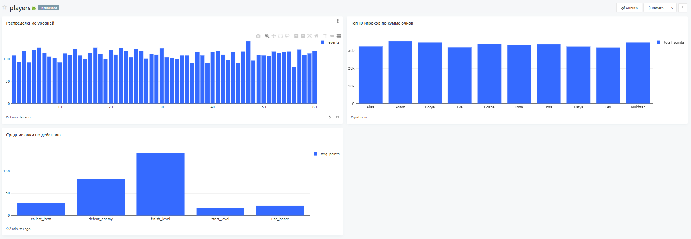

# Лабораторная работа по дисциплине "Аналитик данных"

## ПО: Игровая статистика

### Поля
- Игрок (player)
- Действие (action)
- Очки (points)
- Уровень (level)

## Описание проекта
- Генератор данных на Python
- Dockerfile для этого генератора для последующего использования в docker-compose
- docker-compose для создания контейнеров:
  - Redash 
  - PostgreSQL
  - Генератора событий
  - Jupyter
- Jupyter Notebook для анализа данных из БД с тремя графиками по данным из БД.


## Старт проекта

### 1) Прописываем поля для .env из .env.example, затем прописываем в PS команду

```
cp .env.example .env
```

### 2) Поднимаем все нужные контейнеры командой:
```
docker compose up -d --build
```

### 3) После запуска всех контейнеров, переходим в Redash 

- **Redash**
  - http://localhost:5000
### + Юпитер 
- **Jupyter**
  - Переходим по ссылке: http://localhost:8888
  - Токен для входа: devtoken


## 3 графика по данным с БД


